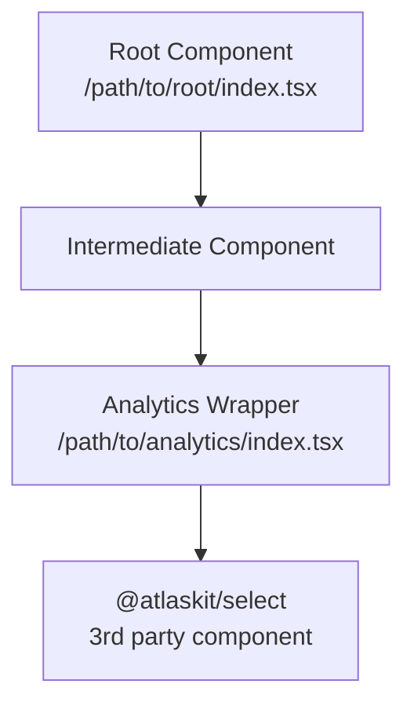
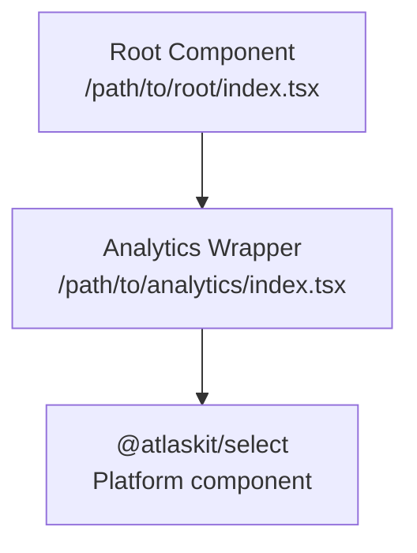
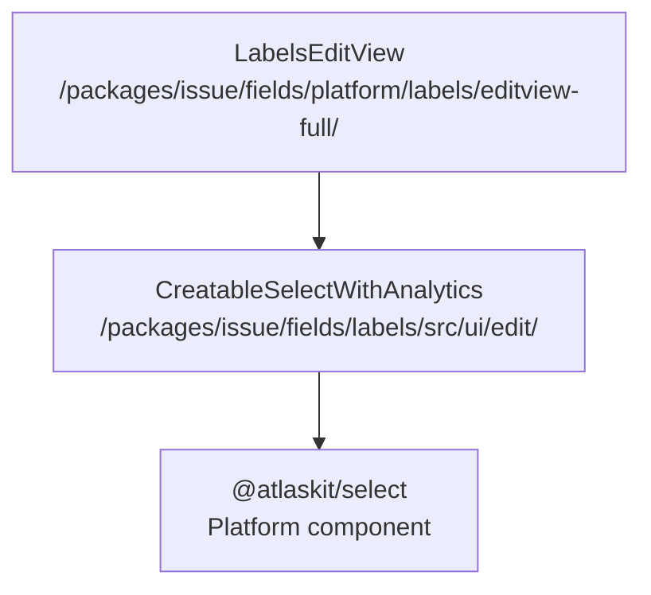
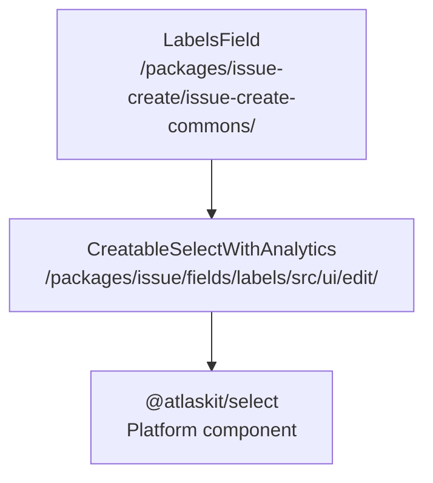

<!-- meta:
  topic: dropdown-field-analytics-analysis
  audience: ai-agent
  token_budget: long
  priority: high
  read_when: analyzing dropdown field analytics in issue view or global issue create
-->

# Dropdown Field Analytics Analysis Guide

> Agent guide for analyzing dropdown field implementations and analytics coverage across Issue View
> and Global Issue Create (GIC) to assess selection algorithm quality

<Self-Reflection>
- Dropdown field analytics track user behavior to measure suggestion algorithm effectiveness
- Good algorithms show users selecting top 3-5 options without search queries
- Component architecture differs between Issue View and GIC but shares analytics patterns
- Analytics may be comprehensive, partial, or missing - document gaps found
</Self-Reflection>

<Where-To-Find-It>
**Issue View Field Components:**
- Location: `/jira/src/packages/issue/fields/platform/{FIELD}/editview-full/src/ui/{FIELD}/`
- Examples: `labels`, `priority`, `parent`
- If not found, try finding it in `jira/src/packages/issue/` directory

**GIC Field Components:**

- Location: `/jira/src/packages/issue-create/issue-create-commons/src/ui/{FIELD}-field/`
- Examples: `labels-field`, `priority-field`, `parent-field`
- If not found, try finding it in `jira/src/packages/issue-create/` directory

**Analytics Utilities:**

- `@atlassian/jira-product-analytics-bridge` - `fireUIAnalytics`, `fireTrackAnalytics`,
  `fireOperationalAnalytics`
- `@atlassian/jira-issue-analytics` - field-specific analytics utilities </Where-To-Find-It>

## Analysis Framework

When analyzing a dropdown field, provide the field name as query context and execute the following
analysis:

### 1. Component Architecture Discovery

**For each context (Issue View and GIC), identify:**

1. **Root component file** - The top-level component that renders the field
2. **Component hierarchy** - Chain from root to leaf (until reaching platform/3rd-party editor)
3. **Key dependencies** - Shared analytics wrappers or utilities
4. **Network API** - GraphQL query, REST endpoint, or data source that provides dropdown options

**Search Strategy:**

```
Issue View: search /jira/src/packages/issue/fields/platform/{FIELD}/editview-full/
GIC: search /jira/src/packages/issue-create/issue-create-commons/src/ui/{FIELD}-field/
Shared: search /jira/src/packages/issue/fields/{FIELD}/
```

### 2. Analytics Event Investigation

**Key metrics to track dropdown selection quality:**

| Metric                     | Purpose                   | Ideal Value       |
| -------------------------- | ------------------------- | ----------------- |
| Selected option value      | Which option user chose   | Captured (hashed) |
| Selected option rank/order | Position in dropdown list | 0-4 (top 5)       |
| Search query text          | User typed to filter      | Empty string      |
| Search query length        | Indicates search usage    | 0                 |
| Options shown count        | Total dropdown options    | Captured          |
| Session tracking           | Link related interactions | UUID present      |

**Analytics Functions to Search:**

- `fireOptionSelectedEvent` - Fires when user selects dropdown option
- `fireOptionCreatedEvent` - Fires when user creates new option (creatable fields)
- `fireInputChangedEvent` - Fires when user types search query
- `fireUIAnalytics` - General UI interaction events
- `fireTrackAnalytics` - User action tracking events
- `fireOperationalAnalytics` - System/performance events

**Search Patterns:**

```
Pattern: fireOptionSelectedEvent|fireTrackAnalytics.*option.*selected
Pattern: selectedOrder|selectedOption|queryLength|queryHash
Pattern: analyticsEvent.*option.*changed
Pattern: useQuery|useLazyLoadQuery|graphql.*Query|fetch.*api.*endpoint
```

### 3. Component Tree Visualization

**Create mermaid diagram showing:**

- Component hierarchy from root to leaf
- File paths for root and leaf components
- Shared analytics wrappers

**Example format:**



### 4. Analytics Coverage Assessment

**Evaluate analytics implementation:**

✅ **Comprehensive Coverage:**

- Selected option value (hashed for privacy)
- Selected option rank/order in list
- Search query presence and length (hashed)
- Options count and filtered options count
- Session tracking with UUID

⚠️ **Partial Coverage:**

- Missing rank/order tracking
- No search query analytics
- Missing session correlation

❌ **No Coverage:**

- No analytics events fired on selection
- No tracking of user interaction

### 5. Gaps and Recommendations

**Common analytics gaps checklist:**

1. **Missing rank/order tracking** - Cannot assess if users select top suggestions
   - Fix: Add `selectedOrder` attribute using index lookup in filtered options
   - File: Analytics wrapper component

2. **No search query analytics** - Cannot measure algorithm effectiveness
   - Fix: Add `queryLength` and `queryHash` attributes to selection events
   - File: Input change handler in analytics wrapper

3. **Missing session correlation** - Cannot link dropdown open → search → select
   - Fix: Generate session UUID on dropdown open, include in all events
   - File: Session management in analytics wrapper

4. **No filtered options context** - Cannot see what options were available
   - Fix: Include `optionsLength` and `options` (truncated) in selection events
   - File: Analytics attribute builder

5. **Inconsistent analytics between Issue View and GIC**
   - Fix: Ensure both contexts use same analytics wrapper component
   - File: Root component imports

## Output Format

**Provide analysis in this structure:**

### Summary Comparison

| Aspect                     | Issue View                                 | Global Issue Create                                  |
| -------------------------- | ------------------------------------------ | ---------------------------------------------------- |
| **Root Component**         | `/path/to/iv/component.tsx`                | `/path/to/gic/component.tsx` or "Same as Issue View" |
| **Analytics File**         | `/path/to/analytics/wrapper.tsx`           | Full path or "Same as Issue View"                    |
| **Network API**            | GraphQL query/REST endpoint                | Full endpoint or "Same as Issue View"                |
| **Selection Event**        | Function name (line number)                | Function name (line number) or "Same as Issue View"  |
| **Selection Attributes**   | `attr1`, `attr2`, `attr3`                  | Attributes list or "Same as Issue View"              |
| **Selected Option Value**  | ✅ Yes - `selectedOption` (hashed)         | Status or "Same as Issue View"                       |
| **Selected Option Rank**   | ✅ Yes - `selectedOrder`                   | Status or "Same as Issue View"                       |
| **Search Query Analytics** | ✅ Yes - `queryLength`, `queryHash`        | Status or "Same as Issue View"                       |
| **Options Context**        | ✅ Yes - `optionsLength`, `options`        | Status or "Same as Issue View"                       |
| **Session Tracking**       | ✅ Yes - `sessionId`                       | Status or "Same as Issue View"                       |
| **Coverage Status**        | ✅ Comprehensive / ⚠️ Partial / ❌ Missing | Status or "Same as Issue View"                       |

### Component Architecture

**Issue View:**

- Root: `/path/to/issue-view/component.tsx`
- Analytics: [Shared wrapper path, if any]



**Options Data Flow (Issue View):**

```
Network API → Root Component → Analytics Wrapper → @atlaskit/select
[GraphQL Query/REST endpoint] → [options prop] → [options prop] → [rendered dropdown]

Example:
useQuery(LabelsQuery) → LabelsEditView → CreatableSelectWithAnalytics → CreatableSelect
```

**Global Issue Create:**

- Root: `/path/to/gic/component.tsx`
- Analytics: [Shared wrapper path, if any]


**Options Data Flow (GIC):**

```
Network API → Root Component → Analytics Wrapper → @atlaskit/select
[GraphQL Query/REST endpoint] → [options prop] → [options prop] → [rendered dropdown]

Example:
useQuery(LabelsQuery) → LabelsField → CreatableSelectWithAnalytics → CreatableSelect
```

### Detailed Analytics Coverage

**Issue View:**

| Metric                | Status  | Details                                      |
| --------------------- | ------- | -------------------------------------------- |
| Selected option value | ✅ / ❌ | Attribute name, file location, line number   |
| Selected option rank  | ✅ / ❌ | Attribute name, implementation details       |
| Search query          | ✅ / ❌ | Attributes captured (queryLength, queryHash) |
| Options context       | ✅ / ❌ | What options data is included                |
| Session tracking      | ✅ / ❌ | Session ID implementation                    |

**Event Locations:**

- Selection event: `/path/to/file.tsx` - `functionName()` (line X)
- Input event: `/path/to/file.tsx` - `functionName()` (line Y)

**Global Issue Create:**

| Metric                | Status  | Details                                      |
| --------------------- | ------- | -------------------------------------------- |
| Selected option value | ✅ / ❌ | Attribute name, file location, line number   |
| Selected option rank  | ✅ / ❌ | Attribute name, implementation details       |
| Search query          | ✅ / ❌ | Attributes captured (queryLength, queryHash) |
| Options context       | ✅ / ❌ | What options data is included                |
| Session tracking      | ✅ / ❌ | Session ID implementation                    |

**Event Locations:**

- Selection event: `/path/to/file.tsx` - `functionName()` (line X)
- Input event: `/path/to/file.tsx` - `functionName()` (line Y)

### Analytics Gaps

**Identified Issues:**

1. [Gap description]
   - Impact: [How this affects algorithm quality measurement]
   - Recommendation: [Specific fix with file and code change needed]

**Algorithm Quality Assessment:**

- Can measure top-N selection: [Yes/No with explanation]
- Can measure search usage: [Yes/No with explanation]
- Can correlate user journey: [Yes/No with explanation]
- Overall coverage: [Comprehensive/Partial/Missing]

## Example Analysis

**Field:** Labels

### Summary Comparison

| Aspect                     | Issue View                                                                                     | Global Issue Create                                                                  |
| -------------------------- | ---------------------------------------------------------------------------------------------- | ------------------------------------------------------------------------------------ |
| **Root Component**         | `/jira/src/packages/issue/fields/platform/labels/editview-full/src/ui/labels/index.tsx`        | `/jira/src/packages/issue-create/issue-create-commons/src/ui/labels-field/index.tsx` |
| **Analytics File**         | `/jira/src/packages/issue/fields/labels/src/ui/edit/creatable-select-with-analytics/index.tsx` | Same as Issue View                                                                   |
| **Network API**            | GraphQL query: `LabelsFieldQuery` (labels pagination)                                          | Same as Issue View                                                                   |
| **Selection Event**        | `fireOptionSelectedEvent` (line 238)                                                           | Same as Issue View                                                                   |
| **Selection Attributes**   | `selectedOption`, `selectedOrder`, `queryHash`, `sessionId`                                    | Same as Issue View                                                                   |
| **Selected Option Value**  | ✅ Yes - `selectedOption` (hashed)                                                             | Same as Issue View                                                                   |
| **Selected Option Rank**   | ✅ Yes - `selectedOrder`                                                                       | Same as Issue View                                                                   |
| **Search Query Analytics** | ✅ Yes - `queryLength`, `queryHash`                                                            | Same as Issue View                                                                   |
| **Options Context**        | ✅ Yes - `optionsLength`, `options`                                                            | Same as Issue View                                                                   |
| **Session Tracking**       | ✅ Yes - `sessionId`                                                                           | Same as Issue View                                                                   |
| **Coverage Status**        | ✅ Comprehensive                                                                               | Same as Issue View                                                                   |

### Component Architecture

**Issue View:**

- Root: `/jira/src/packages/issue/fields/platform/labels/editview-full/src/ui/labels/index.tsx`
- Analytics:
  `/jira/src/packages/issue/fields/labels/src/ui/edit/creatable-select-with-analytics/index.tsx`



**Options Data Flow (Issue View):**

```
GraphQL Query → Root Component → Analytics Wrapper → @atlaskit/select
useLazyLoadQuery(LabelsFieldQuery) → LabelsEditView.options → CreatableSelectWithAnalytics.options → CreatableSelect.options
```

**Global Issue Create:**

- Root: `/jira/src/packages/issue-create/issue-create-commons/src/ui/labels-field/index.tsx`
- Analytics:
  `/jira/src/packages/issue/fields/labels/src/ui/edit/creatable-select-with-analytics/index.tsx`
  (same shared component)



**Options Data Flow (GIC):**

```
GraphQL Query → Root Component → Analytics Wrapper → @atlaskit/select
useLazyLoadQuery(LabelsFieldQuery) → LabelsField.options → CreatableSelectWithAnalytics.options → CreatableSelect.options
```

### Detailed Analytics Coverage

**Issue View:**

| Metric                | Status | Details                                                           |
| --------------------- | ------ | ----------------------------------------------------------------- |
| Selected option value | ✅ Yes | `selectedOption` (hashed) - line 250 in `fireOptionSelectedEvent` |
| Selected option rank  | ✅ Yes | `selectedOrder` via `getItemOrder()` - line 252                   |
| Search query          | ✅ Yes | `queryLength` (line 89), `queryHash` (line 90)                    |
| Options context       | ✅ Yes | `optionsLength` (line 83), `options` truncated (line 87)          |
| Session tracking      | ✅ Yes | `sessionId` UUID (line 93)                                        |

**Event Locations:**

- Selection event:
  `/jira/src/packages/issue/fields/labels/src/ui/edit/creatable-select-with-analytics/index.tsx` -
  `fireOptionSelectedEvent()` (line 238)
- Input event:
  `/jira/src/packages/issue/fields/labels/src/ui/edit/creatable-select-with-analytics/index.tsx` -
  `fireInputChangedEvent()` (line 186)

**Global Issue Create:**

| Metric                | Status | Details                                                           |
| --------------------- | ------ | ----------------------------------------------------------------- |
| Selected option value | ✅ Yes | `selectedOption` (hashed) - line 250 in `fireOptionSelectedEvent` |
| Selected option rank  | ✅ Yes | `selectedOrder` via `getItemOrder()` - line 252                   |
| Search query          | ✅ Yes | `queryLength` (line 89), `queryHash` (line 90)                    |
| Options context       | ✅ Yes | `optionsLength` (line 83), `options` truncated (line 87)          |
| Session tracking      | ✅ Yes | `sessionId` UUID (line 93)                                        |

**Event Locations:**

- Selection event:
  `/jira/src/packages/issue/fields/labels/src/ui/edit/creatable-select-with-analytics/index.tsx` -
  `fireOptionSelectedEvent()` (line 238)
- Input event:
  `/jira/src/packages/issue/fields/labels/src/ui/edit/creatable-select-with-analytics/index.tsx` -
  `fireInputChangedEvent()` (line 186)

**Note:** Both Issue View and GIC use the same shared analytics component, resulting in identical
analytics coverage.

### Analytics Gaps

**None identified - comprehensive coverage**

Both Issue View and GIC implementations share the same analytics wrapper component
(`CreatableSelectWithAnalytics`), ensuring consistent and complete analytics coverage across both
contexts.

**Algorithm Quality Assessment:**

- Can measure top-N selection: ✅ Yes - `selectedOrder` tracks exact position in filtered options
  list
- Can measure search usage: ✅ Yes - `queryLength` shows if user typed search query, `queryHash`
  captures what they searched
- Can correlate user journey: ✅ Yes - `sessionId` UUID links dropdown open → search → selection
  events
- Overall coverage: **Comprehensive** - All key metrics captured for algorithm quality measurement

---

## Usage Instructions for AI Agents

When a developer asks you to analyze dropdown field analytics:

1. Ask for the field name (e.g., "priority", "labels", "assignee")
2. Reference this guide as context
3. Execute the 5-step analysis framework
4. Output results in the specified format
5. Prioritize human readability - use tables, diagrams, and clear sections
6. If analytics gaps found, provide actionable file paths and code suggestions
